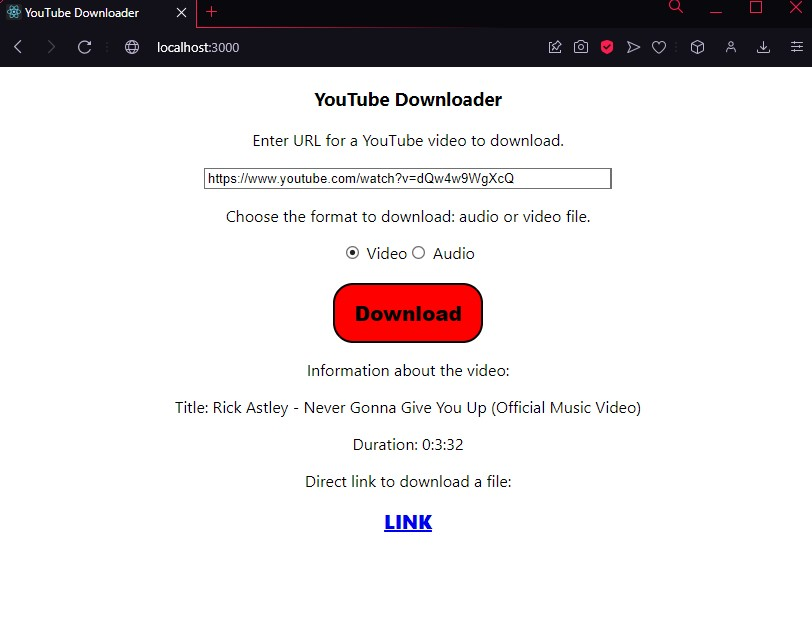
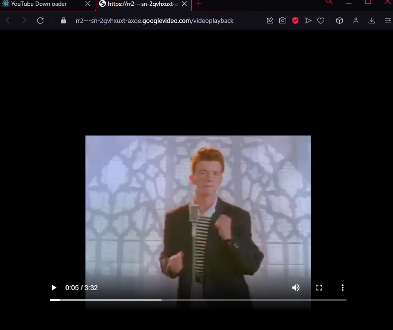
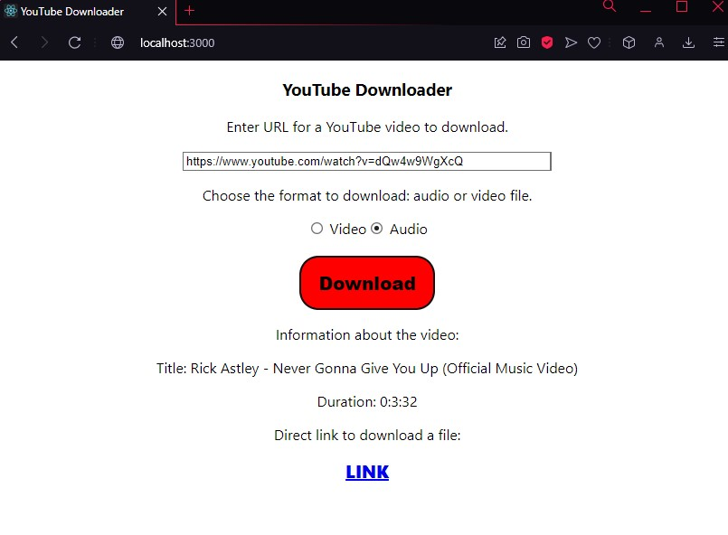
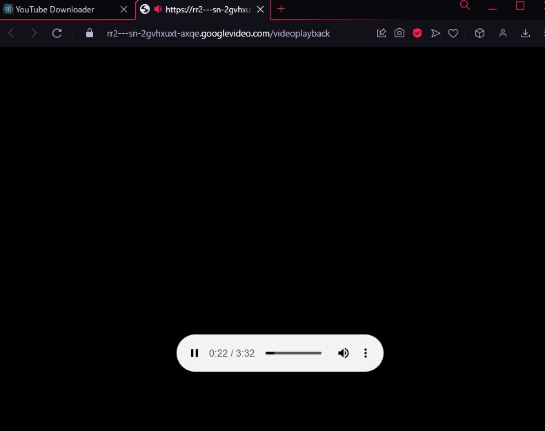
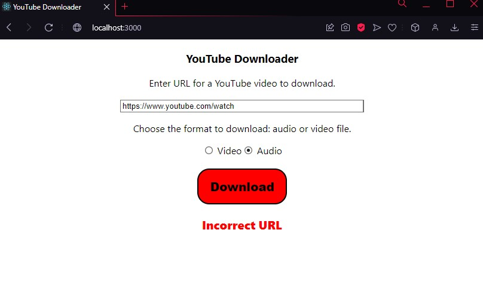
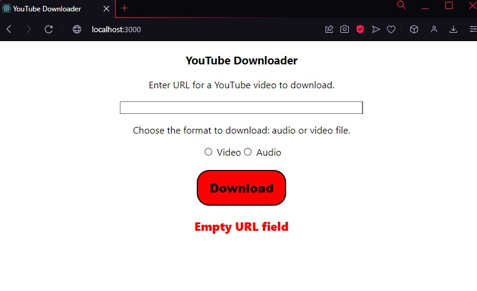
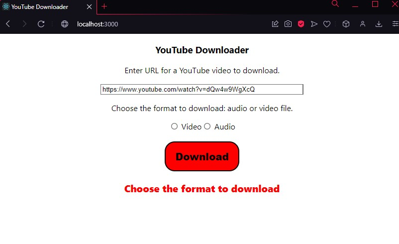

# YouTube-Downloader
YouTube video and audio downloader.

Downloader works in a web browser. 
As input data use a URL for a video on YouTube. You can download file in video or audio format. 
Also, you will see the information about the downloaded video such as title and duration.
As an output of the downloader you will get a direct link to download video or audio.

## Docker

`$ git clone https://github.com/irinareymer/YouTube-Downloader.git`

`$ docker-compose build`

`$ docker-compose up`

## Requirements

All requirements in `requirements.txt`.

### Environment variables:
- SECRET_KEY=

## Examples
Correct usage to download a video:

For audio:

Errors:

If you try to download file with incorrect URL, you will get **Incorrect URL** error.

If you try to download file without URL in the field, you will get **Empty URL field** error.

If you try to download file without specifying file format, you will get **Choose the format to download** error.

